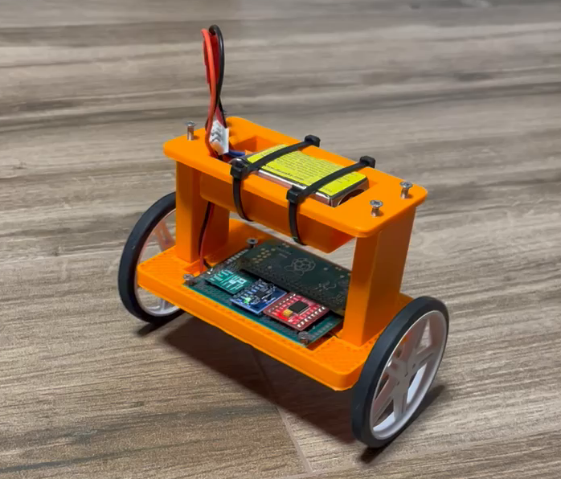

# Autobalancer project

This is my bachelor's project. Its goal was to create self balancing robot and use ML to controll it.


## Build instructions

For the best expirience use provided `Makefile`. It uses included `Dockerfile` to build container image for building the system image.
You can enter `bash` inside container by running:
```
make shell
```

To build whole image run:
```
make all
```

The `artifacts` should appear containing all the resulting packages built and the output sdcard image (`artifacts/images/sdcard.img`).

The first run will take significantly more time to finish that subsequent runs due to previosly unbuild packages.
If you want to rebuild one module, you can run 
```
make [ml/pid/motor_driver]
```

## Structure

```yaml
  - br_external:               # buildroot's external directory
    - board:
      - cmdline.txt            # kernel start command
      - config.txt             # rpi's bootloader config
      - genimage.cfg           # output sdcard image structure, specifies files required by bootloader
      - init.d/                # directory copied by post-build.sh script, copier over /etc/init.d in rpi image
      - interfaces             # debian interfaces file copied over /etc/network/interfaces
      - overlays               # device-tree overlays, compiled by post-build.sh script and copied into rpi-firmware directory
      - post-build.sh          # script triggered by buildroot after build. Defined in defconfig file
      - post-image.sh          # script triggered by buildroot after creating after creating system image, creates sd image
      - sshd_config            # filed copied over /etc/ssh/sshd_config file with ssh server config
      - wpa_supplicant.conf    # filed copied over /etc/wpa_supplicant.conf file with wifi config
    - Config.in                # buildroot config file, specifies Config.in files for packages
    - configs:
      - autobalancer_defconfig # buildroot's defconfig files, specifies which packes to build
    - external.desc            # decription of br-external project
    - external.mk              # file specifying buildroot's mk files for packages
    - package:
      - autobalancer:
        - Config.in            # general buildroot config file for both autobalancer versions
      - autobalancer-ml:
        - autobalancer-ml.mk   # buildroot's mk file, defining how to build this package, points to ml src directory
      - autobalancer-pid:
        - autobalancer-pid.mk  # buildroot's mk file, defining how to build this package, points to pid src directory
      - motor-driver:
        - Config.in            # buildroot config file for motor-driver kernel module
        - motor-driver.mk      # buildroot's mk file, defining how to build this package, points to kernel module src 
      - src:
        -ml/                   # source directory of machine learning version of autobalancer
        -motor-driver/         # source directory of motor driver's kernel module
        -pid/                  # source directory of machine learning version of autobalancer
  - build-tensorflow.sh        # script run in docker container to build tensorflow with correct toolchain
  - circuit.png                # diagram depicting phisical connection between rpi and other components
  - Docerfile                  # file decribing build steps for docker container
  - docker_makefile            # makefile coppied into docker container, resposible for actual build commands
  - Makefile                   # makefile starting and building docker container with proper bind mounts
  - training:
    - self_balancing_robot.py  # training script for neural network used in the project
    - model_diagram.png        # diagram showing model architecture
```
